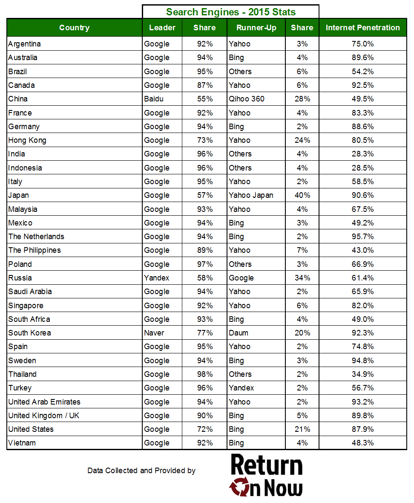

# 第一章：随便聊聊SEO

---

该从何说起呢？

哈哈，有些事情总免不了老生常谈，我们先来说一下**SEO是什么**？放心，我会用最简洁的方式来表述SEO

## 什么是SEO

SEO就是通过顺应搜索引擎规则来实现网站排名最大化的方式

没错，概念其实就是这么简单，SEO的核心目的其实就是为了实现排名最大化（迎合搜索引擎的口味-也叫算法或者叫排名机制）

当前国内市场的搜索引擎百度仍是一家独大，360搜索（好搜）次之，搜狗搜索第三，其它搜索引擎也都占据着自己的那份市场

不过，近年来百度的市场份额一直在缩减，取而代之的是360和搜狗的搜索市场份额在往上增长，因此作为SEO人员，肯定要跟着市场去走，不同的搜索引擎其排名机制都各不相同，但是核心算法不会改变太多（根据当有搜索引擎的发展能力来推断的）

上图展示了2015年各个国家的搜索引擎市场份额，还有网络普及度。

由于没有找到权威的国内市场搜索引擎占比，因此，关于国内搜索市场的占比图该书就无法提供了。

知道了SEO是什么，我们下一步就要明白的是SEO能做什么

## SEO能做什么

通过上节的简单描述，我们清楚了，其实国内的SEO市场主要针对的是百度和好搜（360搜索）这两块，其他搜索引擎的市场我们暂时会忽略不计（竞价的话其他市场也是要考虑的）

那么我们SEO到底能做什么，相信很多同学都想知道这个。

那么我就用简洁的方式来说明一下SEO能做什么

**能带来钱**

哈哈，估计大家看到这里都直接要笑喷了（请原谅我说话的直接），SEO的目的其实就是流量这两个字，而流量的下一步其实是为了转化（收益或者叫成交，下单），最终的目的确实只有一个字-钱（获利）

不禁让人想到了那句“天下熙熙皆为利来、天下攘攘皆为利往”的名句

SEO能把网站的关键字排名页面的排名进行拉升，从而从搜索引擎入口获得自然搜索流量。

当然这也是狭义的SEO，广义的SEO定位是搜索引擎优化，其实不光百度和360，有搜索的地方，就要有排名（根据某种算法计算得出的一种排名），而有排名的地方就可以有SEO。淘宝搜索，知乎搜索，APP商店应用搜索等等，这些场合都有SEO的发展空间。

因此，SEO能做的有很多，但是核心目的是为了流量-->转化-->获利。

聊完了SEO能做什么，我们心里也有个数了，但是有个问题肯定是大家都非常关心的问题

那就是SEO的发展前景怎么样，因为这个牵涉到大家的职业规划和薪水待遇，所以，这点来说还是不能马虎的。

## SEO发展前景

我毕业那会儿，SEO相对来说，还是比较宽松的，外链什么的也根本没有现在这么严，因为，我的第一份工作就是外链专员（专门发外链的）所以相对来说，还是颇为熟悉的，后来，百度几次调整之后对外链的打击力度也越来越大，现在做外链已经没有当初那般容易了。

其实，不光外链，SEO整体行业来说都要比3年前要难，第一自然是因为百度的调整（算法的更加智能），第二就是SEO从业者的人数加剧，竞争的压力也变大了，当然，你不必为此感到悲观，我觉得，你应该反过来感到乐观，因为这正是一个行业走向正规化所经历的。

没错，SEO行业正在走向一个正规化，从事这个行业的人才任职要求也随着水涨船高，以前SEO或许不懂数据分析，不懂网页代码（HTML+CSS），不懂表格处理等等等等（注意等等哦）却仍能做成一个好的SEO，现在，只能说很难。

当然，我并不是说，你不会这些你就找不到SEO工作了，不是的，SEO的工作其实不难找，起步的任职要求也不高，只是，如果，你想成为优秀的SEO，不会这些，真的很难。
