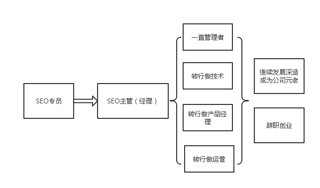

# SEO的职业发展

---

SEO的职业发展大概是这样子的

**SEO专员**

一般负责SEO专员负责SEO流程的其中一个环节或多个环节

常见的有

1.友链交换
2.外链发布
3.软文推广
4.数据分析
5.站内关键词铺设
6.站内内链疏通
7.文章编辑
8.代码优化

等等

**SEO主管**

SEO主管一般负责SEO整个流程环节和各个负责聚道的KPI制定

比如说每天或没周交换友情链接多少条，外链发布多少条，流量达到多少，排名关键词增加多少，页面收录多少等等，这些数据性的指标都是要盯着看的。

一般一个小的SEO团队，有这么几位必不可缺的成员

1. 数据分析（SEO很看重数据分析能力的，数据可以作为导向来指导SEO的工作）
2. 外链发布（这个成员也是比不可缺的，当然你可以选择外包的服务，但是这个工作是必须要做的，只不过实行者不是公司的员工罢了）
3. SEO主管（一个统筹规划，制定计划和KPI的人）

当然，这只是一个大概的人员分配，SEO的工作很多很杂，比如挖掘关键词，筛选关键词，采集文章等等很多杂而碎的工作可根据员工符合程度自由调配

最后，再强调一下一个非常重要的因素——执行力。

正因为SEO的工作琐碎而枯燥，所以，执行力对于SEO从业人员来说就显得弥足珍贵。

作为SEO你要相信一切美好的空话都是华而不实的，而执行力是使你成为一个优秀SEO的必要条件。

至于SEO转行，可以参考一下我的这篇博文：[SEO常见的几个方向](http://www.leesven.com/267.html)
